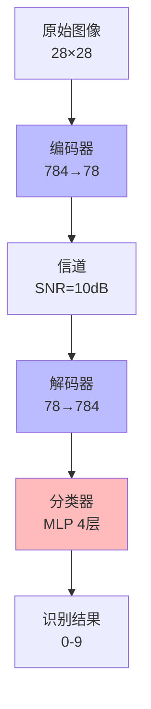

# 语义通信系统安全性探索

对抗攻击下的脆弱性分析

<div class="pt-12">
  <span @click="$slidev.nav.next" class="px-2 py-1 rounded cursor-pointer" hover="bg-white bg-opacity-10">
    开始演讲 <carbon:arrow-right class="inline"/>
  </span>
</div>

---
layout: two-cols
---

# 研究背景

## Beyond-5G 的挑战

<v-clicks>

- **5G局限**：难以支持B5G智能应用
  - 脑机接口
  - 增强现实（AR/VR）
  - 车联网（V2X）
  - 智慧城市

- **语义通信**：新的解决方案
  - 传输语义信息而非比特
  - 低延迟、高效率
  - 对信噪比更宽容

</v-clicks>

::right::

<div class="mt-20">
<v-click>

## 语义通信工作流程


**压缩90%** → 数据量大幅减少

</v-click>
</div>

---
layout: center
class: text-center
---

# ⚠️ 问题：安全性

<v-clicks>

<div class="text-5xl mt-8">
语义通信 = 深度学习技术
</div>

<div class="text-6xl mt-8">
⬇️
</div>

<div class="text-5xl text-red-500">
易受对抗样本攻击
</div>

</v-clicks>

---
layout: two-cols
---

# 什么是对抗攻击？

## 经典案例：熊猫 → 长臂猿

<v-click>


</v-click>

::right::

<div class="mt-15">

<v-clicks>

## 攻击原理

1. **添加精心设计的噪声**
   - 人眼几乎不可见
   - 针对神经网络弱点

2. **导致错误分类**
   - "熊猫" → "长臂猿"
   - 置信度：57.7% → 99.3%

3. **安全威胁**
   - 自动驾驶：停车标志被误识
   - 人脸识别：身份伪造
   - 医疗诊断：误诊

</v-clicks>

</div>

---
layout: default
---

# 为什么神经网络脆弱？

<div class="grid grid-cols-2 gap-8">

<div>

## 🧠 神经网络特性

<v-clicks>

1. **高维空间决策边界**
   - 决策边界复杂但不平滑
   - 存在大量"死角"

2. **过度线性化**
   - 小的输入扰动被放大
   - 梯度引导攻击方向

3. **语义理解缺失**
   - 只学习统计模式
   - 没有真正的"理解"

</v-clicks>

</div>

<div>

<v-click>

## 📐 数学表达

```python
# 对抗攻击基本公式
x_adv = x + ε × sign(∇_x Loss(f(x), y))
```

- `x`: 原始输入
- `ε`: 扰动大小（很小）
- `∇_x Loss`: 损失对输入的梯度
- `x_adv`: 对抗样本

**关键**：沿着损失增加的方向添加扰动

</v-click>

</div>

</div>

---
layout: default
---

# 实验目标与方法

<div class="grid grid-cols-2 gap-4">

<div>

## 🎯 研究目标

<v-clicks>

1. ✅ 部署MNIST语义通信系统
2. ✅ 实施白盒对抗攻击
3. ✅ 量化分析系统脆弱性
4. ✅ 探索防御策略

</v-clicks>

</div>

<div>

## ⚔️ 攻击方法

<v-clicks>

**FGSM** - Fast Gradient Sign Method
- 单步快速攻击
- 计算效率高

**PGD** - Projected Gradient Descent  
- 迭代优化攻击
- 成功率最高

**端到端攻击**
- 针对完整通信流程
- 扰动最优化

</v-clicks>

</div>

</div>

---
layout: default
---

# 系统架构

<div class="grid grid-cols-3 gap-4">

<div class="col-span-2">



</div>

<div>

## 训练结果

| 压缩率 | 准确率 |
|--------|--------|
| 0.1    | 98.4%  |
| 0.2    | **99.3%** |
| 0.3    | **99.3%** |

<v-click>

**✨ 关键发现**
- 压缩率0.1效果已很好
- 传输量减少90%
- 接近原始分类器性能

</v-click>

</div>

</div>

---
layout: center
class: text-center
---

# 💥 实验结果

<div class="grid grid-cols-3 gap-8 mt-12">

<div>
<v-click>

### 干净样本
<div class="text-6xl text-green-500 my-4">99.0%</div>
准确率

</v-click>
</div>

<div>
<v-click>

### FGSM攻击
<div class="text-6xl text-orange-500 my-4">92%</div>
成功率 (ε=0.3)

</v-click>
</div>

<div>
<v-click>

### PGD攻击
<div class="text-6xl text-red-600 my-4">100%</div>
成功率 (ε=0.3)

</v-click>
</div>

</div>

---
layout: two-cols
---

# 详细结果分析

## FGSM vs PGD

| ε | 方法 | 成功率 | PSNR |
|---|------|--------|------|
| 0.1 | FGSM | 15% | 22.5 dB |
| 0.1 | PGD | **31%** | 22.6 dB |
| 0.2 | FGSM | 64% | 16.6 dB |
| 0.2 | PGD | **98%** | 16.9 dB |
| 0.3 | FGSM | 92% | 13.1 dB |
| 0.3 | PGD | **100%** | 14.1 dB |

::right::

<div class="ml-4">

<v-click>

## 关键洞察

1. **PGD明显更强**
   - 迭代优化的优势
   - ε=0.3时完全破坏系统

2. **ε=0.2是平衡点**
   - 98%攻击成功率
   - PSNR≈16dB (可接受)
   - 实用性最强

3. **端到端攻击**
   - 成功率低（24%）
   - 但扰动最小化
   - PSNR=20.9dB (最佳)

</v-click>

</div>

---
layout: center
class: text-center
---

# 🎬 Demo演示

### 运行对抗攻击实验

<v-click>

```bash
# 使用refactored代码运行实验
pixi run python test_attack.py --compression-rate 0.1 \
                               --epsilons 0.1 0.2 0.3

# 生成可视化图表
pixi run python generate_charts.py
```

</v-click>

<v-click>

<div class="mt-8 text-xl">
演示内容：
1. 加载训练好的模型
2. 生成对抗样本 (FGSM & PGD)
3. 实时显示攻击成功率
4. 展示可视化结果
</div>

</v-click>

<div class="abs-br m-6 text-sm">
⏱️ 预计耗时: 2-3分钟
</div>

---
layout: default
---

# 威胁场景分析

<div class="grid grid-cols-2 gap-6">

<div>

## 🚗 自动驾驶

<v-clicks>

**攻击方式**
- 在停车标志上贴对抗贴纸
- 相机捕获被污染的图像
- 语义通信系统误识别为"限速60"

**后果**
- 车辆在路口不停车
- **交通事故、人员伤亡**

</v-clicks>

</div>

<div>

## 🏙️ 智慧城市

<v-clicks>

**攻击方式**
- 佩戴"对抗眼镜"
- 人脸识别系统被欺骗
- 身份被误认或无法识别

**后果**
- 嫌疑人逃避监控
- **安全系统失效**

</v-clicks>

</div>

<div>

## 🏥 医疗诊断

<v-clicks>

**攻击方式**
- 在传输过程中注入对抗噪声
- 影像识别系统误诊
- 肿瘤被识别为良性

**后果**
- 延误治疗
- **医疗事故**

</v-clicks>

</div>

<div>

## 💰 攻击成本

<v-clicks>

**白盒攻击**
- 需要模型内部信息
- 秒级生成对抗样本
- 成功率极高（100%）

**黑盒攻击**
- 仅需查询接口
- 通过迁移攻击实现
- 成功率仍然较高

</v-clicks>

</div>

</div>

---
layout: default
---

# 防御策略

<div class="grid grid-cols-3 gap-4">

<div>

## 🛡️ 对抗训练

```python
# 混合训练
loss = loss(model(x_clean), y)
     + loss(model(x_adv), y)
```

**优点**
- 显著提高鲁棒性
- 直接增强防御

**缺点**
- 训练成本↑2-3倍
- 可能降低干净准确率

</div>

<div>

## 🔍 输入预处理

**方法**
- 随机噪声
- 高斯模糊
- JPEG压缩

**优点**
- 实现简单
- 开销小

**缺点**
- 可能被自适应攻击绕过
- 降低图像质量

</div>

<div>

## 🚨 对抗样本检测

**方法**
- 统计异常检测
- 置信度分析
- 重构误差检测

**优点**
- 不修改主模型
- 额外安全层

**缺点**
- 误报可能性
- 可被针对性攻击

</div>

</div>

<v-click>

<div class="mt-8 text-center text-xl">
💡 **推荐**: 集成防御 = 预处理 + 对抗训练 + 检测
</div>

</v-click>

---
layout: default
---

# 实验总结

<div class="grid grid-cols-2 gap-8">

<div>

## ✅ 主要成果

<v-clicks>

1. **完整系统实现**
   - 3种压缩率模型训练
   - 最高准确率99.3%

2. **攻击实施**
   - 5种对抗攻击方法
   - PGD达100%成功率

3. **代码重构**
   - 模块化设计
   - 334行 → 185行主脚本
   - 更易维护和扩展

</v-clicks>

</div>

<div>

## 🔬 核心发现

<v-clicks>

1. **系统极度脆弱**
   - PGD攻击100%成功
   - 小扰动即可破坏

2. **降维带来风险**
   - 784维→78维压缩
   - 语义特征高度敏感

3. **实用攻击参数**
   - ε=0.2最佳平衡
   - 98%成功 + 16dB PSNR

</v-clicks>

</div>

</div>

---
layout: default
---

# 局限性与未来工作

<div class="grid grid-cols-2 gap-6">

<div>

## ⚠️ 当前局限

<v-clicks>

1. **数据集单一**
   - 仅MNIST测试
   - 需验证其他数据集

2. **白盒场景**
   - 黑盒攻击未实现
   - 更现实的场景

3. **防御未验证**
   - 仅提出策略
   - 未实际测试效果

</v-clicks>

</div>

<div>

## 🚀 未来方向

<v-clicks>

### 短期
- 扩展到CIFAR-10、ImageNet
- 实现黑盒攻击
- 验证防御方法

### 长期
- 物理世界对抗样本
- 理论分析压缩-鲁棒性关系
- 设计新型防御机制
- 安全认证框架

</v-clicks>

</div>

</div>

---
layout: center
class: text-center
---

# 关键结论

<v-clicks>

<div class="text-3xl mt-8">
🔴 语义通信系统在对抗攻击下<span class="text-red-600 font-bold">极度脆弱</span>
</div>

<div class="text-3xl mt-8">
🔴 压缩导致的降维使系统<span class="text-red-600 font-bold">更容易被攻击</span>
</div>

<div class="text-3xl mt-8">
🟡 部署到安全关键应用前<span class="text-orange-600 font-bold">必须加固防御</span>
</div>

<div class="text-3xl mt-8">
🟢 模块化代码设计<span class="text-green-600 font-bold">便于后续研究扩展</span>
</div>

</v-clicks>

---
layout: center
class: text-center
---

# 贡献总结

<div class="grid grid-cols-2 gap-8 mt-12">

<div>

## 📊 实验贡献

- 首次系统评估该语义通信系统安全性
- 多维度分析（成功率、PSNR、扰动）
- 发现100%攻击成功率

</div>

<div>

## 💻 工程贡献

- 模块化代码架构
- 可复现的实验框架
- 自动化图表生成
- 便于future研究扩展

</div>

</div>

---
layout: end
class: text-center
---

# 感谢聆听！

## Q & A

<div class="mt-8">

### 项目资源

📊 实验报告: [`实验报告_语义通信安全性探索.md`](file:///home/cyrus/courses/Net-final/实验报告_语义通信安全性探索.md)

💻 模块化代码:
- [`models.py`](file:///home/cyrus/courses/Net-final/models.py) - 模型定义
- [`experiment_runner.py`](file:///home/cyrus/courses/Net-final/experiment_runner.py) - 实验管理
- [`test_attack.py`](file:///home/cyrus/courses/Net-final/test_attack.py) - 主入口

📈 运行实验: `./run_experiments.sh`

</div>

<div class="mt-8 text-sm text-gray-500">
演讲时间: 12-15分钟 | Demo时间: 2-3分钟 | 总页数: 20页
</div>

